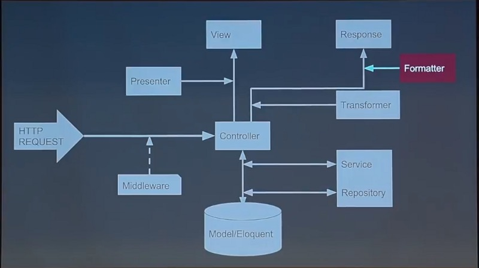

# laravelTools

## simple artisan extend package for laravel

## Directory Structure


## require
```$xslt
php>7.0

laravel>5&6
```

## install
```$xslt
composer require mengdodo/laravel-tools --dev
```

## how to use
create a new trait file  
```$xslt
php artisan make:trait Order
// Trait created successfully in app/Traits/OrderTrait.php
```

create a new service file  
```$xslt
php artisan make:service Mail
// service created successfully in app/Services/MailService.php
```

create a new repository file  
```$xslt
php artisan make:repo Product
// Trait created successfully in app/Repositories/ProductRepository.php
```

create a new presenter file  
```$xslt
php artisan make:presenter Category
// Trait created successfully in app/Presenters/CategoryPresenter.php
```
